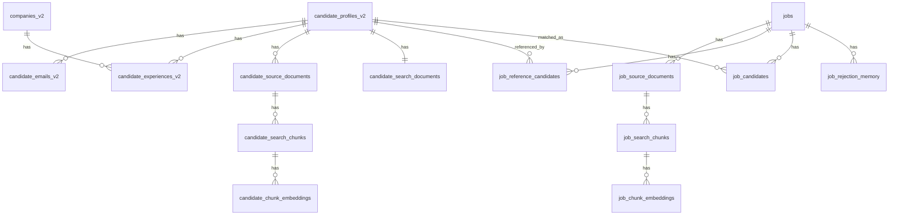

# Recruiting Intelligence System — Schema Contract

This document is the build contract for Codex to create the new tables, relationships, and indexes before backfill and migration.

It supersedes the earlier narrow Task 1 draft by locking both:
- the **canonical candidate/company model**, and
- the **retrieval corpus model** needed for chunking, multiple embeddings, JD matching, reference-candidate matching, and later recruiter-signal enrichment.

## 1. Non-negotiable rules

1. Build inside the current Supabase project first.
2. Do **not** mutate or delete legacy tables during migration.
3. Keep legacy candidate IDs stable where possible; `candidate_profiles_v2.id` reuses the legacy candidate UUID.
4. Treat LinkedIn as the baseline searchable source for every candidate.
5. Treat resumes as higher-signal evidence when present.
6. Treat recruiter notes and transcript summaries as supplemental evidence.
7. Keep `candidate_search_documents` as an aggregate summary/cache, **not** the only search surface.
8. Preserve JD influence in ranking at all times, even when reference-candidate similarity is strong.
9. Route unknown hard-filter values into a `needs_screening` path instead of excluding candidates by default.
10. Prefer deterministic, idempotent, resumable imports, rebuilds, and workers.

---

## 2. Data layers

### Layer A — Canonical candidate/company data
These are the source-of-truth entity tables:
- `candidate_profiles_v2`
- `candidate_emails_v2`
- `companies_v2`
- `candidate_experiences_v2`

### Layer B — Candidate retrieval corpus
These tables store everything searchable about a candidate:
- `candidate_source_documents`
- `candidate_search_chunks`
- `candidate_chunk_embeddings`
- `candidate_search_documents` (aggregate summary/cache only)

### Layer C — Job retrieval corpus and matching memory
These tables store job search inputs, reference candidates, surfaced candidates, and rejection memory:
- `jobs`
- `job_source_documents`
- `job_search_chunks`
- `job_chunk_embeddings`
- `job_reference_candidates`
- `job_candidates`
- `job_rejection_memory`

### Layer D — Later structured recruiter assessments (not required for initial migration)
These are planned, but can be deferred until the recruiter checklist task:
- `job_candidate_assessments`
- `candidate_recruiter_signals`

---

## 3. Relationship overview

---

## 4. Common conventions

### 4.1 Primary keys
- Use `uuid` primary keys for all new tables except where the PK is a natural FK (`candidate_search_documents.candidate_id`).
- `candidate_profiles_v2.id` is **not** auto-generated during backfill; it reuses the stable legacy candidate UUID.

### 4.2 Timestamps
Every mutable table should have:
- `created_at timestamptz not null default now()`
- `updated_at timestamptz not null default now()`

Append-only tables may omit `updated_at` if no row updates are expected.

### 4.3 JSONB provenance
Where raw or semi-structured payloads are needed, use `jsonb`.
Never copy full raw LinkedIn payloads into the canonical profile table.

### 4.4 Searchable text
Store cleaned normalized text separately from raw payloads where appropriate.
Raw payloads are for traceability; cleaned text is for chunking/search.

### 4.5 Embeddings
Use a separate embeddings table per searchable family.
Do **not** store embeddings directly on canonical entity tables.

Recommended initial approach:
- allow variable dimensions in the embeddings tables via `vector`
- store `embedding_dimensions smallint not null`
- store `model_name text not null`
- add ANN indexes only for the currently active retrieval model/dimension

### 4.6 Soft versioning
Use:
- `document_version integer not null default 1`
- `is_active boolean not null default true`
- `superseded_at timestamptz null`
where the same document family can refresh over time.

---

## 5. Table contracts

## 5.A Canonical candidate/company tables

### 5.1 `candidate_profiles_v2`
**Purpose:** one canonical row per candidate.

| Column | Type | Null | Notes |
|---|---|---:|---|
| `id` | `uuid` | no | Reuses legacy candidate UUID; PK |
| `full_name` | `text` | yes | Display name |
| `first_name` | `text` | yes |  |
| `last_name` | `text` | yes |  |
| `linkedin_username` | `text` | yes | Raw normalized username |
| `linkedin_url` | `text` | yes | Canonical LinkedIn URL |
| `linkedin_url_normalized` | `text` | yes | Used for uniqueness/matching |
| `headline` | `text` | yes | Candidate headline |
| `summary` | `text` | yes | Top-level summary/about |
| `location` | `text` | yes | Human-readable location |
| `profile_picture_url` | `text` | yes |  |
| `phone` | `text` | yes | Keep raw/normalized phone later if needed |
| `education_summary` | `text` | yes | Canonical summary/cache |
| `education_schools` | `text[]` | yes | Cache only |
| `education_degrees` | `text[]` | yes | Cache only |
| `education_fields` | `text[]` | yes | Cache only |
| `skills_text` | `text` | yes | Flattened skills cache |
| `top_skills` | `text[]` | yes | Cache only |
| `current_title` | `text` | yes | Derived cache from experiences |
| `current_company_id` | `uuid` | yes | FK to `companies_v2(id)`; derived cache |
| `current_company_name` | `text` | yes | Derived cache |
| `experience_years` | `numeric(5,2)` | yes | Derived cache |
| `source` | `text` | no | e.g. `legacy_backfill`, `linkedin_import`, `resume_upload` |
| `source_record_refs` | `jsonb` | yes | Legacy row refs / provenance |
| `linkedin_enrichment_status` | `text` | yes | e.g. `never`, `queued`, `success`, `failed` |
| `linkedin_enrichment_date` | `timestamptz` | yes | Last successful profile sync |
| `created_at` | `timestamptz` | no | default now() |
| `updated_at` | `timestamptz` | no | default now() |

**Constraints / indexes**
- PK on `id`
- FK `current_company_id -> companies_v2(id)`
- Partial unique on `linkedin_username` where not null
- Partial unique on `linkedin_url_normalized` where not null
- Index on `current_company_id`
- Index on `updated_at`

**Source-of-truth rules**
- `current_*` fields and `experience_years` are **derived caches only**.
- Work-history truth lives in `candidate_experiences_v2`.

---

### 5.2 `candidate_emails_v2`
**Purpose:** one row per candidate email.

| Column | Type | Null | Notes |
|---|---|---:|---|
| `id` | `uuid` | no | PK |
| `candidate_id` | `uuid` | no | FK to `candidate_profiles_v2(id)` |
| `email_raw` | `text` | no | Original value |
| `email_normalized` | `citext` | no | Lowercased/normalized email |
| `email_type` | `text` | yes | personal/work/unknown |
| `email_source` | `text` | yes | source system |
| `is_primary` | `boolean` | no | default false |
| `quality` | `text` | yes | provider-specific quality bucket |
| `result` | `text` | yes | verification result |
| `resultcode` | `text` | yes | verification provider code |
| `subresult` | `text` | yes |  |
| `verification_date` | `timestamptz` | yes |  |
| `verification_attempts` | `integer` | no | default 0 |
| `last_verification_attempt` | `timestamptz` | yes |  |
| `raw_response` | `jsonb` | yes | provider response |
| `created_at` | `timestamptz` | no |  |
| `updated_at` | `timestamptz` | no |  |

**Constraints / indexes**
- PK on `id`
- FK `candidate_id -> candidate_profiles_v2(id)` on delete cascade
- Unique on `(candidate_id, email_normalized)`
- Partial unique on `email_normalized` where not null
- Partial unique on `(candidate_id)` where `is_primary = true`
- Index on `candidate_id`

---

### 5.3 `companies_v2`
**Purpose:** canonical company directory.

| Column | Type | Null | Notes |
|---|---|---:|---|
| `id` | `uuid` | no | PK |
| `name` | `text` | no | Canonical display name |
| `normalized_name` | `text` | no | For fallback matching only |
| `linkedin_id` | `text` | yes | Strongest identity when available |
| `linkedin_username` | `text` | yes |  |
| `linkedin_url` | `text` | yes |  |
| `linkedin_url_normalized` | `text` | yes |  |
| `website` | `text` | yes |  |
| `description` | `text` | yes |  |
| `industries` | `text[]` | yes |  |
| `specialties` | `text[]` | yes |  |
| `company_type` | `text` | yes |  |
| `staff_count` | `integer` | yes |  |
| `staff_count_range` | `text` | yes | Derived bucket |
| `headquarters_city` | `text` | yes |  |
| `headquarters_country` | `text` | yes |  |
| `logo_url` | `text` | yes |  |
| `enrichment_status` | `text` | yes | `never`, `queued`, `success`, `failed` |
| `last_enrichment_sync` | `timestamptz` | yes |  |
| `data_source` | `text` | no | primary source provenance |
| `identity_basis` | `text` | no | `linkedin_id`, `linkedin_username`, `linkedin_url`, `name` |
| `created_at` | `timestamptz` | no |  |
| `updated_at` | `timestamptz` | no |  |

**Constraints / indexes**
- PK on `id`
- Partial unique on `linkedin_id` where not null
- Partial unique on `linkedin_username` where not null
- Partial unique on `linkedin_url_normalized` where not null
- Index on `normalized_name`

**Source-of-truth rules**
- Do **not** enforce DB-level uniqueness on `normalized_name` alone.
- Company resolution precedence is:
  1. `linkedin_id`
  2. `linkedin_username`
  3. `linkedin_url_normalized`
  4. `normalized_name` fallback

---

### 5.4 `candidate_experiences_v2`
**Purpose:** one row per candidate experience item; source of truth for work history.

| Column | Type | Null | Notes |
|---|---|---:|---|
| `id` | `uuid` | no | PK |
| `candidate_id` | `uuid` | no | FK to `candidate_profiles_v2(id)` |
| `company_id` | `uuid` | yes | FK to `companies_v2(id)` |
| `experience_index` | `integer` | no | Stable order within profile |
| `title` | `text` | yes |  |
| `description` | `text` | yes |  |
| `location` | `text` | yes |  |
| `raw_company_name` | `text` | yes | Original company text |
| `source_company_linkedin_username` | `text` | yes | For resolution/audit |
| `start_date` | `date` | yes | Normalized |
| `start_date_precision` | `text` | yes | `year`, `month`, `day`, `unknown` |
| `end_date` | `date` | yes | Normalized |
| `end_date_precision` | `text` | yes | `year`, `month`, `day`, `present`, `unknown` |
| `is_current` | `boolean` | no | default false |
| `source_payload` | `jsonb` | yes | Raw experience fragment |
| `source_hash` | `text` | no | Deterministic hash for dedupe/idempotency |
| `created_at` | `timestamptz` | no |  |
| `updated_at` | `timestamptz` | no |  |

**Constraints / indexes**
- PK on `id`
- FK `candidate_id -> candidate_profiles_v2(id)` on delete cascade
- FK `company_id -> companies_v2(id)` on delete set null
- Unique on `(candidate_id, source_hash)`
- Index on `(candidate_id, experience_index)`
- Index on `company_id`
- Index on `(candidate_id, is_current)`

**Source-of-truth rules**
- This table drives current-role derivation.
- When only month precision is known, normalize to the first day of that month and preserve true precision in the precision columns.

---

## 5.B Candidate retrieval corpus tables

### 5.5 `candidate_source_documents`
**Purpose:** one row per searchable candidate artifact.

Examples:
- LinkedIn profile snapshot
- resume text
- raw recruiter note
- approved recruiter-note summary
- transcript summary

| Column | Type | Null | Notes |
|---|---|---:|---|
| `id` | `uuid` | no | PK |
| `candidate_id` | `uuid` | no | FK to `candidate_profiles_v2(id)` |
| `source_type` | `text` | no | `linkedin_profile`, `resume`, `recruiter_note_raw`, `recruiter_note_summary`, `transcript_summary`, `manual_profile_note` |
| `source_subtype` | `text` | yes | optional finer classification |
| `title` | `text` | yes | display/debug title |
| `source_url` | `text` | yes | e.g. LinkedIn URL or file URL |
| `external_source_ref` | `text` | yes | source-system pointer |
| `raw_payload` | `jsonb` | yes | original payload / metadata |
| `raw_text` | `text` | yes | extracted raw text |
| `normalized_text` | `text` | yes | cleaned text used for chunking |
| `metadata_json` | `jsonb` | yes | page count, parser version, etc. |
| `trust_level` | `text` | no | `baseline`, `high`, `supplemental`, `approved` |
| `document_version` | `integer` | no | default 1 |
| `is_active` | `boolean` | no | default true |
| `effective_at` | `timestamptz` | yes | when this version became current |
| `superseded_at` | `timestamptz` | yes |  |
| `ingested_at` | `timestamptz` | no | default now() |
| `created_at` | `timestamptz` | no |  |
| `updated_at` | `timestamptz` | no |  |

**Constraints / indexes**
- PK on `id`
- FK `candidate_id -> candidate_profiles_v2(id)` on delete cascade
- Index on `(candidate_id, source_type, is_active)`
- Index on `document_version`
- Index on `trust_level`

**Rules**
- Every candidate must have at least one active `linkedin_profile` source document.
- Resume uploads create separate source documents; do not merge resume text into LinkedIn source rows.
- Raw recruiter notes and approved summaries are separate rows.

---

### 5.6 `candidate_search_chunks`
**Purpose:** one row per chunk derived from a candidate source document.

| Column | Type | Null | Notes |
|---|---|---:|---|
| `id` | `uuid` | no | PK |
| `candidate_id` | `uuid` | no | FK to `candidate_profiles_v2(id)` |
| `source_document_id` | `uuid` | no | FK to `candidate_source_documents(id)` |
| `source_type` | `text` | no | denormalized from source doc for easier filtering |
| `chunk_type` | `text` | no | e.g. `headline_about`, `current_role`, `experience_item`, `skills_block`, `resume_summary`, `project_section`, `note_summary` |
| `section_key` | `text` | yes | stable logical key |
| `chunk_index` | `integer` | no | order within document |
| `chunk_text` | `text` | no | searchable text |
| `token_count_estimate` | `integer` | yes | optional |
| `char_count` | `integer` | yes | optional |
| `source_priority` | `integer` | no | higher means stronger source class; exact weight applied in ranking, not in storage |
| `trust_level` | `text` | no | copied/derived from source document |
| `document_version` | `integer` | no | copied from source document |
| `is_searchable` | `boolean` | no | default true |
| `created_at` | `timestamptz` | no |  |
| `updated_at` | `timestamptz` | no |  |

**Constraints / indexes**
- PK on `id`
- FK `candidate_id -> candidate_profiles_v2(id)` on delete cascade
- FK `source_document_id -> candidate_source_documents(id)` on delete cascade
- Unique on `(source_document_id, chunk_index)`
- Index on `(candidate_id, source_type)`
- Index on `(candidate_id, chunk_type)`
- Index on `(source_document_id, is_searchable)`

**Chunking rules**
- LinkedIn profile: split into headline/about, current role, one chunk per experience item, skills block.
- Resume: split into summary, one chunk per role/project section, skills block, optionally certs/education.
- Raw recruiter notes: if short, one chunk; if long, paragraph/section chunks.
- Approved note summary / transcript summary: one or more concise chunks by topic.

---

### 5.7 `candidate_chunk_embeddings`
**Purpose:** one row per candidate chunk embedding per model/version.

| Column | Type | Null | Notes |
|---|---|---:|---|
| `id` | `uuid` | no | PK |
| `candidate_id` | `uuid` | no | FK to `candidate_profiles_v2(id)` |
| `chunk_id` | `uuid` | no | FK to `candidate_search_chunks(id)` |
| `model_name` | `text` | no | e.g. `text-embedding-3-small` |
| `model_version` | `text` | yes | optional logical version label |
| `embedding_dimensions` | `smallint` | no | explicit dimension count |
| `embedding` | `vector` | no | pgvector column |
| `is_active` | `boolean` | no | default true |
| `generated_at` | `timestamptz` | no |  |
| `created_at` | `timestamptz` | no |  |

**Constraints / indexes**
- PK on `id`
- FK `candidate_id -> candidate_profiles_v2(id)` on delete cascade
- FK `chunk_id -> candidate_search_chunks(id)` on delete cascade
- Unique on `(chunk_id, model_name, model_version)`
- Index on `(candidate_id, model_name, is_active)`
- Index on `(chunk_id, is_active)`
- Add ANN index only for the active retrieval model/dimension chosen for production

**Rules**
- Multiple embeddings per candidate are expected.
- One candidate may have many chunks and therefore many embeddings.
- Rebuilds create a new row or update the row only if the logical model/version is unchanged.

---

### 5.8 `candidate_search_documents`
**Purpose:** one aggregate summary/cache row per candidate.

This is **not** the primary vector-retrieval table.
It exists for admin views, debugging, coarse retrieval, and flattened candidate inspection.

| Column | Type | Null | Notes |
|---|---|---:|---|
| `candidate_id` | `uuid` | no | PK and FK to `candidate_profiles_v2(id)` |
| `search_text` | `text` | no | flattened summary built from canonical + selected retrieval evidence |
| `current_title` | `text` | yes | cache |
| `current_company_id` | `uuid` | yes | cache |
| `current_company_name` | `text` | yes | cache |
| `location` | `text` | yes | cache |
| `experience_years` | `numeric(5,2)` | yes | cache |
| `education_schools` | `text[]` | yes | cache |
| `education_degrees` | `text[]` | yes | cache |
| `skills` | `text[]` | yes | cache |
| `prior_company_ids` | `uuid[]` | yes | cache |
| `prior_company_names` | `text[]` | yes | cache |
| `summary_source_types` | `text[]` | yes | which source types were included |
| `document_version` | `integer` | no | default 1 |
| `rebuilt_at` | `timestamptz` | no |  |
| `created_at` | `timestamptz` | no |  |
| `updated_at` | `timestamptz` | no |  |

**Constraints / indexes**
- PK on `candidate_id`
- FK `candidate_id -> candidate_profiles_v2(id)` on delete cascade
- FK `current_company_id -> companies_v2(id)` on delete set null
- Index on `current_company_id`

---

## 5.C Job retrieval and matching tables

### 5.9 `jobs`
**Purpose:** one row per job search / matching workflow.

| Column | Type | Null | Notes |
|---|---|---:|---|
| `id` | `uuid` | no | PK |
| `title` | `text` | yes | optional display title |
| `company_name` | `text` | yes | snapshot display field |
| `jd_text_raw` | `text` | no | original JD text |
| `jd_text_normalized` | `text` | yes | cleaned text |
| `jd_metadata_json` | `jsonb` | yes | parsed fields, source metadata |
| `hard_filter_config` | `jsonb` | yes | recruiter-selected pass/fail rules |
| `preferred_filter_config` | `jsonb` | yes | softer preference config |
| `status` | `text` | no | e.g. `draft`, `ready`, `running`, `completed`, `failed` |
| `latest_run_started_at` | `timestamptz` | yes |  |
| `latest_run_completed_at` | `timestamptz` | yes |  |
| `created_by` | `uuid` | yes | user id when auth layer is present |
| `created_at` | `timestamptz` | no |  |
| `updated_at` | `timestamptz` | no |  |

**Constraints / indexes**
- PK on `id`
- Index on `status`
- Index on `created_at`

**Rules**
- Unknown candidate values do not fail hard filters by default.
- Hard-filter semantics must support `pass`, `fail`, and `needs_screening`.

---

### 5.10 `job_source_documents`
**Purpose:** one row per job-scoped searchable artifact.

Examples:
- the JD itself
- a frozen snapshot of an attached reference candidate

| Column | Type | Null | Notes |
|---|---|---:|---|
| `id` | `uuid` | no | PK |
| `job_id` | `uuid` | no | FK to `jobs(id)` |
| `document_kind` | `text` | no | `jd`, `reference_candidate_snapshot` |
| `job_reference_candidate_id` | `uuid` | yes | FK to `job_reference_candidates(id)` when snapshot |
| `title` | `text` | yes |  |
| `raw_payload` | `jsonb` | yes | raw parsed data / metadata |
| `raw_text` | `text` | yes | original text |
| `normalized_text` | `text` | yes | cleaned text |
| `document_version` | `integer` | no | default 1 |
| `is_active` | `boolean` | no | default true |
| `created_at` | `timestamptz` | no |  |
| `updated_at` | `timestamptz` | no |  |

**Constraints / indexes**
- PK on `id`
- FK `job_id -> jobs(id)` on delete cascade
- FK `job_reference_candidate_id -> job_reference_candidates(id)` on delete cascade
- Index on `(job_id, document_kind, is_active)`

---

### 5.11 `job_search_chunks`
**Purpose:** one row per chunk derived from a job source document.

| Column | Type | Null | Notes |
|---|---|---:|---|
| `id` | `uuid` | no | PK |
| `job_id` | `uuid` | no | FK to `jobs(id)` |
| `source_document_id` | `uuid` | no | FK to `job_source_documents(id)` |
| `document_kind` | `text` | no | denormalized for filtering |
| `chunk_type` | `text` | no | e.g. `jd_summary`, `jd_must_have`, `jd_preferred`, `jd_domain_context`, `reference_current_role`, `reference_experience_item` |
| `section_key` | `text` | yes | stable section identifier |
| `chunk_index` | `integer` | no | order within source document |
| `chunk_text` | `text` | no | searchable text |
| `token_count_estimate` | `integer` | yes |  |
| `char_count` | `integer` | yes |  |
| `is_searchable` | `boolean` | no | default true |
| `created_at` | `timestamptz` | no |  |
| `updated_at` | `timestamptz` | no |  |

**Constraints / indexes**
- PK on `id`
- FK `job_id -> jobs(id)` on delete cascade
- FK `source_document_id -> job_source_documents(id)` on delete cascade
- Unique on `(source_document_id, chunk_index)`
- Index on `(job_id, document_kind, chunk_type)`

---

### 5.12 `job_chunk_embeddings`
**Purpose:** one row per job chunk embedding per model/version.

| Column | Type | Null | Notes |
|---|---|---:|---|
| `id` | `uuid` | no | PK |
| `job_id` | `uuid` | no | FK to `jobs(id)` |
| `chunk_id` | `uuid` | no | FK to `job_search_chunks(id)` |
| `model_name` | `text` | no |  |
| `model_version` | `text` | yes |  |
| `embedding_dimensions` | `smallint` | no |  |
| `embedding` | `vector` | no | pgvector column |
| `is_active` | `boolean` | no | default true |
| `generated_at` | `timestamptz` | no |  |
| `created_at` | `timestamptz` | no |  |

**Constraints / indexes**
- PK on `id`
- FK `job_id -> jobs(id)` on delete cascade
- FK `chunk_id -> job_search_chunks(id)` on delete cascade
- Unique on `(chunk_id, model_name, model_version)`
- Index on `(job_id, model_name, is_active)`
- Add ANN index only for the active production model/dimension

---

### 5.13 `job_reference_candidates`
**Purpose:** attached ideal/reference candidates for a job.

A reference candidate may:
- already exist in the candidate DB, or
- be imported from a LinkedIn URL during job creation and then persisted as a normal candidate.

| Column | Type | Null | Notes |
|---|---|---:|---|
| `id` | `uuid` | no | PK |
| `job_id` | `uuid` | no | FK to `jobs(id)` |
| `candidate_id` | `uuid` | no | FK to `candidate_profiles_v2(id)` |
| `source_type` | `text` | no | `existing_candidate`, `recruiter_linkedin_url`, `hiring_manager_linkedin_url`, `promoted_strong_candidate` |
| `source_linkedin_url` | `text` | yes | original URL when applicable |
| `archetype_label` | `text` | yes | optional grouping like `backend_infra`, `data_platform` |
| `is_active` | `boolean` | no | default true |
| `created_by` | `uuid` | yes |  |
| `created_at` | `timestamptz` | no |  |
| `updated_at` | `timestamptz` | no |  |

**Constraints / indexes**
- PK on `id`
- FK `job_id -> jobs(id)` on delete cascade
- FK `candidate_id -> candidate_profiles_v2(id)` on delete restrict
- Unique on `(job_id, candidate_id, coalesce(archetype_label, ''))`
- Index on `(job_id, is_active)`
- Index on `(candidate_id)`

**Rules**
- Attaching a reference candidate always links to a permanent `candidate_id`.
- A job-scoped snapshot of that candidate is stored separately in `job_source_documents`.

---

### 5.14 `job_candidates`
**Purpose:** one row per surfaced candidate for a job.

| Column | Type | Null | Notes |
|---|---|---:|---|
| `id` | `uuid` | no | PK |
| `job_id` | `uuid` | no | FK to `jobs(id)` |
| `candidate_id` | `uuid` | no | FK to `candidate_profiles_v2(id)` |
| `jd_score` | `double precision` | yes | best JD-based similarity/composite subscore |
| `best_reference_candidate_id` | `uuid` | yes | FK to `job_reference_candidates(id)` |
| `best_reference_score` | `double precision` | yes | best reference-candidate similarity |
| `exact_match_score` | `double precision` | yes | exact/keyword signal contribution |
| `final_score` | `double precision` | yes | final reranked score |
| `match_strategy` | `text` | yes | `jd`, `reference_candidate`, `hybrid` |
| `keyword_level` | `text` | yes | strictness/funnel level |
| `hard_filter_outcome` | `text` | yes | `pass`, `fail`, `needs_screening` |
| `needs_screening` | `boolean` | no | default false |
| `screening_reasons` | `text[]` | yes | e.g. unknown location, unknown visa |
| `best_candidate_chunk_id` | `uuid` | yes | FK to `candidate_search_chunks(id)` |
| `best_job_chunk_id` | `uuid` | yes | FK to `job_search_chunks(id)` |
| `best_source_type` | `text` | yes | source family that drove strongest evidence |
| `evidence_json` | `jsonb` | yes | additional evidence/debug payload |
| `recruiter_action` | `text` | yes | `strong`, `rejected`, `skipped`, `needs_screening`, null |
| `recruiter_action_reason` | `text` | yes | optional reason |
| `actioned_by` | `uuid` | yes |  |
| `actioned_at` | `timestamptz` | yes |  |
| `first_seen_at` | `timestamptz` | no | default now() |
| `last_scored_at` | `timestamptz` | yes |  |
| `created_at` | `timestamptz` | no |  |
| `updated_at` | `timestamptz` | no |  |

**Constraints / indexes**
- PK on `id`
- FK `job_id -> jobs(id)` on delete cascade
- FK `candidate_id -> candidate_profiles_v2(id)` on delete cascade
- FK `best_reference_candidate_id -> job_reference_candidates(id)` on delete set null
- FK `best_candidate_chunk_id -> candidate_search_chunks(id)` on delete set null
- FK `best_job_chunk_id -> job_search_chunks(id)` on delete set null
- Unique on `(job_id, candidate_id)`
- Index on `(job_id, final_score desc)`
- Index on `(job_id, recruiter_action)`
- Index on `(job_id, hard_filter_outcome)`
- Index on `(candidate_id)`

**Rules**
- This table stores the current candidate state for a job.
- It must remain explainable: best evidence pointers and evidence JSON are required.

---

### 5.15 `job_rejection_memory`
**Purpose:** durable memory of rejected candidates or rejection-based search exclusions for a job.

| Column | Type | Null | Notes |
|---|---|---:|---|
| `id` | `uuid` | no | PK |
| `job_id` | `uuid` | no | FK to `jobs(id)` |
| `candidate_id` | `uuid` | yes | FK to `candidate_profiles_v2(id)` when candidate-specific |
| `job_candidate_id` | `uuid` | yes | FK to `job_candidates(id)` when derived from surfaced result |
| `memory_type` | `text` | no | `candidate_rejection`, `manual_rule`, `future_cluster_rejection` |
| `reason_code` | `text` | yes | optional standardized reason |
| `reason_notes` | `text` | yes | optional human note |
| `memory_payload` | `jsonb` | yes | future-safe payload for richer rejection memory |
| `created_by` | `uuid` | yes |  |
| `created_at` | `timestamptz` | no |  |

**Constraints / indexes**
- PK on `id`
- FK `job_id -> jobs(id)` on delete cascade
- FK `candidate_id -> candidate_profiles_v2(id)` on delete set null
- FK `job_candidate_id -> job_candidates(id)` on delete set null
- Index on `(job_id, memory_type)`
- Index on `(job_id, candidate_id)`

**Rules**
- Initial implementation can be candidate-level memory.
- The schema leaves room for future negative-cluster memory without redesigning the table.

---

## 6. Chunking and embedding contract

### 6.1 Candidate chunking contract
Each candidate should produce multiple chunks.

Minimum expected chunks by source type:
- **LinkedIn profile**
  - headline/about
  - current role
  - one chunk per experience item
  - skills block
- **Resume**
  - resume summary
  - one chunk per role/project section
  - skills block
  - optionally certs/education
- **Recruiter note raw**
  - one chunk if short
  - paragraph/section chunks if long
- **Recruiter note summary / transcript summary**
  - one or more concise topical chunks

### 6.2 Job chunking contract
Each job should produce multiple chunks.

Minimum expected chunks:
- JD summary
- JD must-have requirements
- JD preferred requirements
- JD responsibilities
- JD domain / company context

Each attached reference candidate snapshot should also produce chunks:
- current role
- strongest experience items
- skills / specialization summary

### 6.3 Embedding rules
- Generate embeddings at the **chunk** level.
- Multiple embeddings per candidate are expected.
- Multiple embeddings per job are expected.
- Do not collapse multiple reference candidates into one averaged embedding before retrieval.
- Keep the currently active retrieval model indexed; retain older embeddings for reproducibility where useful.

---

## 7. Matching and ranking contract

### 7.1 Retrieval inputs
Matching must support:
- JD chunk retrieval
- reference-candidate snapshot retrieval
- exact/keyword reinforcement for high-signal tech terms
- structured filters

### 7.2 Candidate evidence weighting
The schema does not lock the exact formula, but it does lock the evidence families:
- LinkedIn = baseline evidence
- resume = stronger evidence when present
- recruiter note raw = lower-trust supplemental evidence
- recruiter note summary / transcript summary = higher-trust supplemental evidence

### 7.3 Unknown hard-filter values
Unknown values do not fail by default.
They should map to `needs_screening` unless the recruiter explicitly configures otherwise.

### 7.4 Explainability
Every surfaced `job_candidates` row must preserve enough evidence to answer:
- what JD chunk matched?
- what candidate chunk matched?
- did a reference candidate drive the result?
- what source type contributed most strongly?

---

## 8. Explicit exclusions from the initial migration

These items are **not** part of the initial canonical schema contract:
- separate normalized skills tables
- separate normalized education tables
- compensation negotiation history
- visa/authorization truth tables
- security-clearance truth tables
- full audit/event tables for every recruiter action
- full raw LinkedIn payload copies on canonical profile rows

These may be added later if the product requires them.

---

## 9. Planned later tables for structured recruiter checklist

These are recommended but can be deferred until the recruiter checklist task.

### 9.1 `job_candidate_assessments`
Job-scoped recruiter answers for a candidate.

Suggested columns:
- `id uuid pk`
- `job_id uuid not null`
- `candidate_id uuid not null`
- `question_key text not null`
- `answer_value jsonb not null`
- `confidence text null`
- `answered_by uuid null`
- `answered_at timestamptz not null`
- `created_at timestamptz not null`

### 9.2 `candidate_recruiter_signals`
Reusable long-lived recruiter signals promoted from job-scoped assessments.

Suggested columns:
- `id uuid pk`
- `candidate_id uuid not null`
- `signal_key text not null`
- `signal_value jsonb not null`
- `confidence text null`
- `source_assessment_id uuid null`
- `is_active boolean not null default true`
- `effective_at timestamptz not null`
- `superseded_at timestamptz null`
- `created_at timestamptz not null`

---

## 10. Migration and backfill order implied by this contract

1. Create canonical tables.
2. Create candidate retrieval tables.
3. Backfill companies.
4. Backfill candidate profiles and emails.
5. Backfill candidate experiences.
6. Create candidate source documents from LinkedIn baseline.
7. Add resume / note / transcript source documents where available.
8. Build candidate chunks.
9. Build candidate chunk embeddings.
10. Build aggregate candidate search documents.
11. Create job and matching tables.
12. Add JD and reference-candidate retrieval artifacts.

---

## 11. Acceptance criterion

Codex should be able to generate DDL and validation scaffolding from this document without inventing:
- missing tables
- missing foreign keys
- missing chunk/embedding storage rules
- missing candidate-vs-job boundaries
- missing reference-candidate behavior
- missing source-of-truth rules

