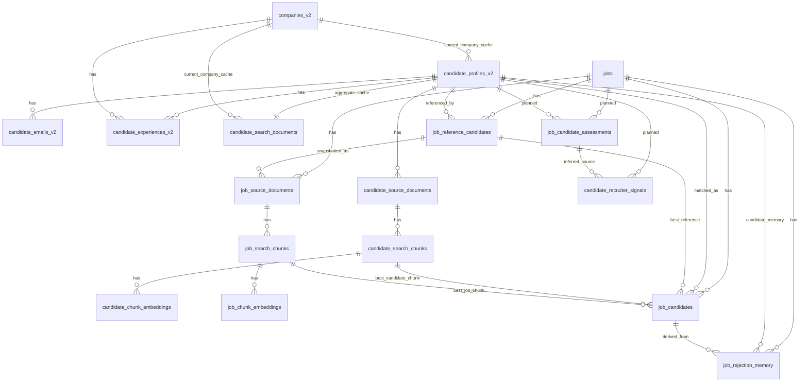

# V2 Schema Handoff

This document is the shareable schema handoff for the recruiting platform’s `v2` model.

It is designed for another LLM or engineer to use as a build reference for an MVP.

## Source-of-truth order

1. `SCHEMA_CONTRACT.md` — authoritative for tables, fields, relationships, constraints, and boundaries
2. `TASKS.md` — authoritative for what is already implemented vs planned for later
3. `README.md` / `AGENT.md` — terminology and project-shape guardrails

If anything conflicts with older docs, **follow `SCHEMA_CONTRACT.md`**.

---

## Current state summary

### Already implemented in this repo
- Layer A canonical tables
- Layer B candidate retrieval tables
- `canonicalization_ambiguities` support table
- canonicalization helper functions and validation SQL

### Still planned for MVP-critical work
- Layer C job intake / job retrieval / match-state tables

### Still planned for later work
- Layer D recruiter assessment tables

### Recommended MVP schema scope
If the goal is a usable MVP quickly, build around:
- Layer A: canonical candidate/company data
- Layer B: candidate retrieval corpus
- `canonicalization_ambiguities`
- Layer C: jobs + job retrieval + match-state

Layer D can wait.

---

## Terminology to keep

Use these names:
- `job_reference_candidates`
- `job_rejection_memory`
- `candidate_source_documents`
- `candidate_search_chunks`
- `candidate_chunk_embeddings`
- `job_source_documents`
- `job_search_chunks`
- `job_chunk_embeddings`

Do **not** reintroduce superseded old names from older docs:
- `seeds`
- `rejected_embeddings`

Do **not** regress to old storage assumptions:
- no embedding on `candidate_search_documents`
- no embedding directly on `jobs`
- retrieval is chunk-level, not one-vector-per-candidate or one-vector-per-job

---

## Full relationship map

> Note: the Layer D relationship from `candidate_recruiter_signals.source_assessment_id` to `job_candidate_assessments.id` is an **inference** from the planned column name, not a finalized FK contract yet.

---

## Table inventory at a glance

| Table | Layer | Status | MVP relevance | Purpose |
|---|---|---|---|---|
| `candidate_profiles_v2` | A | Implemented | Required | Canonical candidate row |
| `candidate_emails_v2` | A | Implemented | Required | Canonical candidate emails |
| `companies_v2` | A | Implemented | Required | Canonical company directory |
| `candidate_experiences_v2` | A | Implemented | Required | Canonical work history |
| `canonicalization_ambiguities` | Support | Implemented | Required | Ambiguity logging/manual-review queue |
| `candidate_source_documents` | B | Implemented | Required | Candidate retrieval artifacts |
| `candidate_search_chunks` | B | Implemented | Required | Candidate document chunks |
| `candidate_chunk_embeddings` | B | Implemented | Required | Candidate chunk embeddings |
| `candidate_search_documents` | B | Implemented | Optional cache | Aggregate candidate search/debug cache |
| `jobs` | C | Planned | Required | Job search workflow root |
| `job_source_documents` | C | Planned | Required | JD + reference-candidate snapshots |
| `job_search_chunks` | C | Planned | Required | Job document chunks |
| `job_chunk_embeddings` | C | Planned | Required | Job chunk embeddings |
| `job_reference_candidates` | C | Planned | Required | Attached ideal/reference candidates |
| `job_candidates` | C | Planned | Required | Surfaced candidates for a job |
| `job_rejection_memory` | C | Planned | Required | Durable rejection memory |
| `job_candidate_assessments` | D | Planned later | Defer | Job-scoped recruiter checklist answers |
| `candidate_recruiter_signals` | D | Planned later | Defer | Reusable candidate-level recruiter signals |

---

# Detailed table contracts

## Layer A — Canonical candidate/company data

## `candidate_profiles_v2`
- **Status:** Implemented
- **Purpose:** one canonical row per candidate
- **Primary key:** `id uuid`
- **Key foreign keys:**
  - `current_company_id -> companies_v2.id`
- **Key relationships:**
  - 1:N to `candidate_emails_v2`
  - 1:N to `candidate_experiences_v2`
  - 1:N to `candidate_source_documents`
  - 1:1 to `candidate_search_documents`
  - planned 1:N to `job_reference_candidates`
  - planned 1:N to `job_candidates`
- **Fields:**
  - `id uuid not null` — reuses stable legacy candidate UUID
  - `full_name text null`
  - `first_name text null`
  - `last_name text null`
  - `linkedin_username text null`
  - `linkedin_url text null`
  - `linkedin_url_normalized text null`
  - `headline text null`
  - `summary text null`
  - `location text null`
  - `profile_picture_url text null`
  - `phone text null`
  - `education_summary text null`
  - `education_schools text[] null`
  - `education_degrees text[] null`
  - `education_fields text[] null`
  - `skills_text text null`
  - `top_skills text[] null`
  - `current_title text null` — derived cache
  - `current_company_id uuid null` — derived cache FK
  - `current_company_name text null` — derived cache
  - `experience_years numeric(5,2) null` — derived cache
  - `source text not null`
  - `source_record_refs jsonb null`
  - `linkedin_enrichment_status text null`
  - `linkedin_enrichment_date timestamptz null`
  - `created_at timestamptz not null`
  - `updated_at timestamptz not null`
- **Important constraints:**
  - partial unique on `linkedin_username` where not null
  - partial unique on `linkedin_url_normalized` where not null
- **Important notes:**
  - `current_*` fields and `experience_years` are caches only
  - work-history truth lives in `candidate_experiences_v2`
  - candidate identity should only be merged by stable candidate UUID reuse or strong LinkedIn identity

## `candidate_emails_v2`
- **Status:** Implemented
- **Purpose:** one row per candidate email
- **Primary key:** `id uuid`
- **Key foreign keys:**
  - `candidate_id -> candidate_profiles_v2.id` (`on delete cascade`)
- **Key relationships:**
  - many emails belong to one candidate
- **Fields:**
  - `id uuid not null`
  - `candidate_id uuid not null`
  - `email_raw text not null`
  - `email_normalized citext not null`
  - `email_type text null`
  - `email_source text null`
  - `is_primary boolean not null default false`
  - `quality text null`
  - `result text null`
  - `resultcode text null`
  - `subresult text null`
  - `verification_date timestamptz null`
  - `verification_attempts integer not null default 0`
  - `last_verification_attempt timestamptz null`
  - `raw_response jsonb null`
  - `created_at timestamptz not null`
  - `updated_at timestamptz not null`
- **Important constraints:**
  - unique on `(candidate_id, email_normalized)`
  - partial unique on `email_normalized` where not null
  - partial unique on `candidate_id` where `is_primary = true`
- **Important notes:**
  - `email_normalized` is the deterministic dedupe key
  - preserve original source value in `email_raw`

## `companies_v2`
- **Status:** Implemented
- **Purpose:** canonical company directory
- **Primary key:** `id uuid`
- **Key relationships:**
  - 1:N to `candidate_experiences_v2`
  - referenced by `candidate_profiles_v2.current_company_id`
  - referenced by `candidate_search_documents.current_company_id`
- **Fields:**
  - `id uuid not null`
  - `name text not null`
  - `normalized_name text not null`
  - `linkedin_id text null`
  - `linkedin_username text null`
  - `linkedin_url text null`
  - `linkedin_url_normalized text null`
  - `website text null`
  - `description text null`
  - `industries text[] null`
  - `specialties text[] null`
  - `company_type text null`
  - `staff_count integer null`
  - `staff_count_range text null`
  - `headquarters_city text null`
  - `headquarters_country text null`
  - `logo_url text null`
  - `enrichment_status text null`
  - `last_enrichment_sync timestamptz null`
  - `data_source text not null`
  - `identity_basis text not null`
  - `source_record_refs jsonb null`
  - `created_at timestamptz not null`
  - `updated_at timestamptz not null`
- **Important constraints:**
  - partial unique on `linkedin_id` where not null
  - partial unique on `linkedin_username` where not null
  - partial unique on `linkedin_url_normalized` where not null
  - index on `normalized_name`
- **Important notes:**
  - `normalized_name` is fallback matching only, not a DB-level uniqueness key
  - company resolution precedence is `linkedin_id` -> `linkedin_username` -> `linkedin_url_normalized` -> `normalized_name`
  - never auto-merge across contradictory strong LinkedIn identity

## `candidate_experiences_v2`
- **Status:** Implemented
- **Purpose:** one row per candidate experience item; source of truth for work history
- **Primary key:** `id uuid`
- **Key foreign keys:**
  - `candidate_id -> candidate_profiles_v2.id` (`on delete cascade`)
  - `company_id -> companies_v2.id` (`on delete set null`)
- **Key relationships:**
  - many experiences belong to one candidate
  - optionally many experiences resolve to one company
- **Fields:**
  - `id uuid not null`
  - `candidate_id uuid not null`
  - `company_id uuid null`
  - `experience_index integer not null`
  - `title text null`
  - `description text null`
  - `location text null`
  - `raw_company_name text null`
  - `source_company_linkedin_username text null`
  - `start_date date null`
  - `start_date_precision text null`
  - `end_date date null`
  - `end_date_precision text null`
  - `is_current boolean not null default false`
  - `source_payload jsonb null`
  - `source_hash text not null`
  - `created_at timestamptz not null`
  - `updated_at timestamptz not null`
- **Important constraints:**
  - unique on `(candidate_id, source_hash)`
- **Important notes:**
  - this table drives current-role derivation
  - `source_hash` must be deterministic and built from normalized identity fields
  - preserve `raw_company_name` even when `company_id` resolves

---

## Support table used by canonicalization

## `canonicalization_ambiguities`
- **Status:** Implemented
- **Purpose:** durable log of ambiguous candidate, company, experience, and source-document matches
- **Primary key:** `id uuid`
- **Fields:**
  - `id uuid not null`
  - `entity_type text not null` — `candidate_profile`, `company`, `candidate_experience`, `candidate_source_document`
  - `ambiguity_type text not null`
  - `source_system text null`
  - `source_record_ref text null`
  - `normalized_input jsonb not null`
  - `matched_record_ids uuid[] null`
  - `recommended_action text not null` — `skip`, `manual_review`
  - `status text not null` — `open`, `resolved`, `ignored`
  - `resolution_notes text null`
  - `created_at timestamptz not null`
  - `updated_at timestamptz not null`
  - `resolved_at timestamptz null`
- **Important constraints:**
  - check constraints on `entity_type`, `recommended_action`, and `status`
  - unique open ambiguity identity on normalized input + source reference
- **Important notes:**
  - ambiguous records must be logged here instead of silently auto-merging
  - repeated runs should reuse the same open ambiguity where possible

---

## Layer B — Candidate retrieval corpus

## `candidate_source_documents`
- **Status:** Implemented
- **Purpose:** one row per searchable candidate artifact
- **Primary key:** `id uuid`
- **Key foreign keys:**
  - `candidate_id -> candidate_profiles_v2.id` (`on delete cascade`)
- **Key relationships:**
  - many source documents belong to one candidate
  - 1:N to `candidate_search_chunks`
- **Fields:**
  - `id uuid not null`
  - `candidate_id uuid not null`
  - `source_type text not null` — e.g. `linkedin_profile`, `resume`, `recruiter_note_raw`, `recruiter_note_summary`, `transcript_summary`, `manual_profile_note`
  - `source_subtype text null`
  - `title text null`
  - `source_url text null`
  - `external_source_ref text null`
  - `raw_payload jsonb null`
  - `raw_text text null`
  - `normalized_text text null`
  - `metadata_json jsonb null`
  - `trust_level text not null` — `baseline`, `high`, `supplemental`, `approved`
  - `document_version integer not null default 1`
  - `is_active boolean not null default true`
  - `effective_at timestamptz null`
  - `superseded_at timestamptz null`
  - `ingested_at timestamptz not null`
  - `created_at timestamptz not null`
  - `updated_at timestamptz not null`
- **Important notes:**
  - every candidate must have at least one active `linkedin_profile` document
  - resumes, notes, summaries, and transcripts remain separate documents
  - document decisions must classify incoming rows as `no_op`, `supersede`, `parallel`, or `ambiguous`

## `candidate_search_chunks`
- **Status:** Implemented
- **Purpose:** one row per chunk derived from a candidate source document
- **Primary key:** `id uuid`
- **Key foreign keys:**
  - `candidate_id -> candidate_profiles_v2.id` (`on delete cascade`)
  - `source_document_id -> candidate_source_documents.id` (`on delete cascade`)
- **Key relationships:**
  - many chunks belong to one candidate source document
  - 1:N to `candidate_chunk_embeddings`
- **Fields:**
  - `id uuid not null`
  - `candidate_id uuid not null`
  - `source_document_id uuid not null`
  - `source_type text not null`
  - `chunk_type text not null`
  - `section_key text null`
  - `chunk_index integer not null`
  - `chunk_text text not null`
  - `token_count_estimate integer null`
  - `char_count integer null`
  - `source_priority integer not null`
  - `trust_level text not null`
  - `document_version integer not null`
  - `is_searchable boolean not null default true`
  - `created_at timestamptz not null`
  - `updated_at timestamptz not null`
- **Important constraints:**
  - unique on `(source_document_id, chunk_index)`
- **Important notes:**
  - chunk identity is within a document version
  - chunking is source-type aware, not purely fixed-window based

## `candidate_chunk_embeddings`
- **Status:** Implemented
- **Purpose:** one row per candidate chunk embedding per model/version
- **Primary key:** `id uuid`
- **Key foreign keys:**
  - `candidate_id -> candidate_profiles_v2.id` (`on delete cascade`)
  - `chunk_id -> candidate_search_chunks.id` (`on delete cascade`)
- **Key relationships:**
  - many embeddings belong to one candidate and one chunk
- **Fields:**
  - `id uuid not null`
  - `candidate_id uuid not null`
  - `chunk_id uuid not null`
  - `model_name text not null`
  - `model_version text null`
  - `embedding_dimensions smallint not null`
  - `embedding vector not null`
  - `is_active boolean not null default true`
  - `generated_at timestamptz not null`
  - `created_at timestamptz not null`
- **Important constraints:**
  - unique on `(chunk_id, model_name, model_version)`
  - ANN index only for the active production combo
- **Important notes:**
  - embeddings live here, not on canonical tables
  - multiple embeddings per candidate are expected because retrieval is chunk-level

## `candidate_search_documents`
- **Status:** Implemented
- **Purpose:** one aggregate summary/cache row per candidate
- **Primary key:** `candidate_id uuid`
- **Key foreign keys:**
  - `candidate_id -> candidate_profiles_v2.id` (`on delete cascade`)
  - `current_company_id -> companies_v2.id` (`on delete set null`)
- **Key relationships:**
  - exactly one aggregate cache row per candidate
- **Fields:**
  - `candidate_id uuid not null`
  - `search_text text not null`
  - `current_title text null`
  - `current_company_id uuid null`
  - `current_company_name text null`
  - `location text null`
  - `experience_years numeric(5,2) null`
  - `education_schools text[] null`
  - `education_degrees text[] null`
  - `skills text[] null`
  - `prior_company_ids uuid[] null`
  - `prior_company_names text[] null`
  - `summary_source_types text[] null`
  - `document_version integer not null default 1`
  - `rebuilt_at timestamptz not null`
  - `created_at timestamptz not null`
  - `updated_at timestamptz not null`
- **Important notes:**
  - this is a rebuildable cache, not a merge target
  - this is not the primary retrieval surface
  - this should not carry the main embedding column

---

## Layer C — Job retrieval corpus and match-state tables

> These tables are defined in the schema contract but are **not implemented in migrations yet**.

## `jobs`
- **Status:** Planned
- **Purpose:** one row per job search / matching workflow
- **Primary key:** `id uuid`
- **Planned relationships:**
  - 1:N to `job_source_documents`
  - 1:N to `job_reference_candidates`
  - 1:N to `job_candidates`
  - 1:N to `job_rejection_memory`
- **Fields:**
  - `id uuid not null`
  - `title text null`
  - `company_name text null`
  - `jd_text_raw text not null`
  - `jd_text_normalized text null`
  - `jd_metadata_json jsonb null`
  - `hard_filter_config jsonb null`
  - `preferred_filter_config jsonb null`
  - `status text not null` — e.g. `draft`, `ready`, `running`, `completed`, `failed`
  - `latest_run_started_at timestamptz null`
  - `latest_run_completed_at timestamptz null`
  - `created_by uuid null`
  - `created_at timestamptz not null`
  - `updated_at timestamptz not null`
- **Important notes:**
  - unknown candidate values should map to `needs_screening`, not fail by default
  - do not place the main embedding directly on this table

## `job_source_documents`
- **Status:** Planned
- **Purpose:** one row per job-scoped searchable artifact
- **Primary key:** `id uuid`
- **Planned foreign keys:**
  - `job_id -> jobs.id` (`on delete cascade`)
  - `job_reference_candidate_id -> job_reference_candidates.id` (`on delete cascade`) when the document is a reference-candidate snapshot
- **Planned relationships:**
  - many source documents belong to one job
  - 1:N to `job_search_chunks`
- **Fields:**
  - `id uuid not null`
  - `job_id uuid not null`
  - `document_kind text not null` — `jd`, `reference_candidate_snapshot`
  - `job_reference_candidate_id uuid null`
  - `title text null`
  - `raw_payload jsonb null`
  - `raw_text text null`
  - `normalized_text text null`
  - `document_version integer not null default 1`
  - `is_active boolean not null default true`
  - `created_at timestamptz not null`
  - `updated_at timestamptz not null`
- **Important notes:**
  - this stores the JD itself plus frozen job-scoped snapshots of reference candidates

## `job_search_chunks`
- **Status:** Planned
- **Purpose:** one row per chunk derived from a job source document
- **Primary key:** `id uuid`
- **Planned foreign keys:**
  - `job_id -> jobs.id` (`on delete cascade`)
  - `source_document_id -> job_source_documents.id` (`on delete cascade`)
- **Fields:**
  - `id uuid not null`
  - `job_id uuid not null`
  - `source_document_id uuid not null`
  - `document_kind text not null`
  - `chunk_type text not null`
  - `section_key text null`
  - `chunk_index integer not null`
  - `chunk_text text not null`
  - `token_count_estimate integer null`
  - `char_count integer null`
  - `is_searchable boolean not null default true`
  - `created_at timestamptz not null`
  - `updated_at timestamptz not null`
- **Important constraints:**
  - unique on `(source_document_id, chunk_index)`
- **Important notes:**
  - expected chunk families include JD summary, must-have, preferred, responsibilities, domain context, and reference-candidate chunks

## `job_chunk_embeddings`
- **Status:** Planned
- **Purpose:** one row per job chunk embedding per model/version
- **Primary key:** `id uuid`
- **Planned foreign keys:**
  - `job_id -> jobs.id` (`on delete cascade`)
  - `chunk_id -> job_search_chunks.id` (`on delete cascade`)
- **Fields:**
  - `id uuid not null`
  - `job_id uuid not null`
  - `chunk_id uuid not null`
  - `model_name text not null`
  - `model_version text null`
  - `embedding_dimensions smallint not null`
  - `embedding vector not null`
  - `is_active boolean not null default true`
  - `generated_at timestamptz not null`
  - `created_at timestamptz not null`
- **Important constraints:**
  - unique on `(chunk_id, model_name, model_version)`
  - ANN index only for the active production combo
- **Important notes:**
  - mirror the candidate chunk-embedding pattern; do not collapse the job into one monolithic vector

## `job_reference_candidates`
- **Status:** Planned
- **Purpose:** attached ideal/reference candidates for a job
- **Primary key:** `id uuid`
- **Planned foreign keys:**
  - `job_id -> jobs.id` (`on delete cascade`)
  - `candidate_id -> candidate_profiles_v2.id` (`on delete restrict`)
- **Planned relationships:**
  - many reference candidates belong to one job
  - one reference candidate always points to a permanent candidate row
  - a job-scoped snapshot of the reference candidate lives in `job_source_documents`
- **Fields:**
  - `id uuid not null`
  - `job_id uuid not null`
  - `candidate_id uuid not null`
  - `source_type text not null` — `existing_candidate`, `recruiter_linkedin_url`, `hiring_manager_linkedin_url`, `promoted_strong_candidate`
  - `source_linkedin_url text null`
  - `archetype_label text null`
  - `is_active boolean not null default true`
  - `created_by uuid null`
  - `created_at timestamptz not null`
  - `updated_at timestamptz not null`
- **Important constraints:**
  - unique on `(job_id, candidate_id, coalesce(archetype_label, ''))`
- **Important notes:**
  - reference candidates must link to permanent `candidate_id` rows
  - multiple archetypes per job are allowed via `archetype_label`

## `job_candidates`
- **Status:** Planned
- **Purpose:** one row per surfaced candidate for a job
- **Primary key:** `id uuid`
- **Planned foreign keys:**
  - `job_id -> jobs.id` (`on delete cascade`)
  - `candidate_id -> candidate_profiles_v2.id` (`on delete cascade`)
  - `best_reference_candidate_id -> job_reference_candidates.id` (`on delete set null`)
  - `best_candidate_chunk_id -> candidate_search_chunks.id` (`on delete set null`)
  - `best_job_chunk_id -> job_search_chunks.id` (`on delete set null`)
- **Planned relationships:**
  - many surfaced candidates belong to one job
  - one candidate can appear in many jobs
- **Fields:**
  - `id uuid not null`
  - `job_id uuid not null`
  - `candidate_id uuid not null`
  - `jd_score double precision null`
  - `best_reference_candidate_id uuid null`
  - `best_reference_score double precision null`
  - `exact_match_score double precision null`
  - `final_score double precision null`
  - `match_strategy text null` — `jd`, `reference_candidate`, `hybrid`
  - `keyword_level text null`
  - `hard_filter_outcome text null` — `pass`, `fail`, `needs_screening`
  - `needs_screening boolean not null default false`
  - `screening_reasons text[] null`
  - `best_candidate_chunk_id uuid null`
  - `best_job_chunk_id uuid null`
  - `best_source_type text null`
  - `evidence_json jsonb null`
  - `recruiter_action text null` — `strong`, `rejected`, `skipped`, `needs_screening`, or null
  - `recruiter_action_reason text null`
  - `actioned_by uuid null`
  - `actioned_at timestamptz null`
  - `first_seen_at timestamptz not null`
  - `last_scored_at timestamptz null`
  - `created_at timestamptz not null`
  - `updated_at timestamptz not null`
- **Important constraints:**
  - unique on `(job_id, candidate_id)`
- **Important notes:**
  - this is the current state table for a candidate within a job
  - the row must remain explainable via best evidence pointers and `evidence_json`

## `job_rejection_memory`
- **Status:** Planned
- **Purpose:** durable memory of rejected candidates or rejection-based exclusions for a job
- **Primary key:** `id uuid`
- **Planned foreign keys:**
  - `job_id -> jobs.id` (`on delete cascade`)
  - `candidate_id -> candidate_profiles_v2.id` (`on delete set null`)
  - `job_candidate_id -> job_candidates.id` (`on delete set null`)
- **Fields:**
  - `id uuid not null`
  - `job_id uuid not null`
  - `candidate_id uuid null`
  - `job_candidate_id uuid null`
  - `memory_type text not null` — `candidate_rejection`, `manual_rule`, `future_cluster_rejection`
  - `reason_code text null`
  - `reason_notes text null`
  - `memory_payload jsonb null`
  - `created_by uuid null`
  - `created_at timestamptz not null`
- **Important notes:**
  - initial implementation can be candidate-level memory
  - the schema leaves room for richer future negative memory without redesigning the table

---

## Layer D — Later structured recruiter assessment tables

> These are explicitly planned later and can be deferred until after the first usable MVP.

## `job_candidate_assessments`
- **Status:** Planned later
- **Purpose:** job-scoped recruiter answers for a candidate
- **Contract status:** suggested columns only; final FK/index contract is not locked yet
- **Intended relationships:**
  - intended `job_id -> jobs.id`
  - intended `candidate_id -> candidate_profiles_v2.id`
- **Suggested fields from the contract:**
  - `id uuid pk`
  - `job_id uuid not null`
  - `candidate_id uuid not null`
  - `question_key text not null`
  - `answer_value jsonb not null`
  - `confidence text null`
  - `answered_by uuid null`
  - `answered_at timestamptz not null`
  - `created_at timestamptz not null`
- **Important notes:**
  - job-scoped assessment answers should not directly overwrite canonical candidate fields

## `candidate_recruiter_signals`
- **Status:** Planned later
- **Purpose:** reusable long-lived recruiter signals promoted from job-scoped assessments
- **Contract status:** suggested columns only; final FK/index contract is not locked yet
- **Intended relationships:**
  - intended `candidate_id -> candidate_profiles_v2.id`
  - likely `source_assessment_id -> job_candidate_assessments.id` (**inference, not finalized**)
- **Suggested fields from the contract:**
  - `id uuid pk`
  - `candidate_id uuid not null`
  - `signal_key text not null`
  - `signal_value jsonb not null`
  - `confidence text null`
  - `source_assessment_id uuid null`
  - `is_active boolean not null default true`
  - `effective_at timestamptz not null`
  - `superseded_at timestamptz null`
  - `created_at timestamptz not null`
- **Important notes:**
  - only durable confirmed signals should be promoted here
  - this table is for reusable candidate-level signal memory, not raw recruiter notes

---

## Build rules another LLM should preserve

1. **Canonical vs retrieval boundary is non-negotiable.**
   - canonical truth stays in Layer A
   - retrieval artifacts stay in Layer B and Layer C

2. **Chunk-level retrieval is required.**
   - candidate embeddings live in `candidate_chunk_embeddings`
   - job embeddings live in `job_chunk_embeddings`
   - do not replace this with one-vector-per-candidate or one-vector-per-job shortcuts

3. **`candidate_search_documents` is a cache, not the primary retrieval surface.**

4. **`candidate_experiences_v2` is the work-history source of truth.**
   - `candidate_profiles_v2.current_*` fields are derived caches only

5. **Candidate identity must remain stable.**
   - reuse legacy candidate UUID for `candidate_profiles_v2.id` during backfill

6. **Reference candidates must always point to permanent candidate rows.**
   - job snapshots are separate retrieval documents, not substitutes for canonical candidate identity

7. **Ambiguity must be measurable.**
   - log ambiguous matches in `canonicalization_ambiguities`
   - never silently auto-merge contradictory identities

8. **Source precedence must be preserved.**
   - `linkedin_import` / direct LinkedIn sync
   - `legacy_backfill` with LinkedIn-backed source data
   - `resume_upload`
   - `recruiter_note_summary` / `transcript_summary`
   - `recruiter_note_raw` / `manual_profile_note`

9. **Unknown hard-filter values should default to `needs_screening`.**

10. **Do not invent extra phase-1 tables.**
    Explicit exclusions from the contract include:
    - separate normalized skills tables
    - separate normalized education tables
    - compensation negotiation history
    - visa truth tables
    - security-clearance truth tables
    - full audit/event tables for every recruiter action

---

## Practical MVP implementation order

1. Keep Layer A and Layer B exactly as documented.
2. Finish canonicalization behavior and keep ambiguity logging active.
3. Backfill canonical candidate/company data and candidate retrieval artifacts.
4. Add Layer C tables.
5. Add JD ingestion and reference-candidate snapshotting.
6. Run JD retrieval + reference-candidate retrieval + reranking.
7. Keep Layer D deferred until recruiter checklist work begins.

---

## One-line handoff summary

**Current v2 schema = Layer A canonical + Layer B candidate retrieval + `canonicalization_ambiguities`; MVP still needs Layer C job/matching tables; Layer D recruiter assessment tables are intentionally deferred.**
